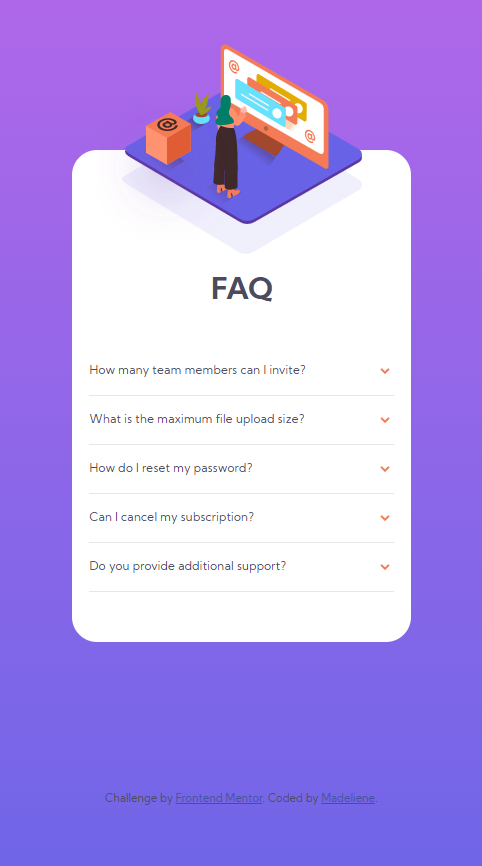

# Frontend Mentor - FAQ accordion card solution

This is a solution to the [FAQ accordion card challenge on Frontend Mentor](https://www.frontendmentor.io/challenges/faq-accordion-card-XlyjD0Oam). Frontend Mentor challenges help you improve your coding skills by building realistic projects.

## Table of contents

- [Overview](#overview)
  - [The challenge](#the-challenge)
  - [Screenshot](#screenshot)
  - [Links](#links)
- [My process](#my-process)
  - [Built with](#built-with)
  - [What I learned](#what-i-learned)
  - [Continued development](#continued-development)
  - [Useful resources](#useful-resources)
- [Author](#author)

## Overview

### The challenge

Users should be able to:

- View the optimal layout for the component depending on their device's screen size
- See hover states for all interactive elements on the page
- Hide/Show the answer to a question when the question is clicked

### Screenshot

- Desktop view: <br>


- Mobile view: <br>


### Links

- Solution URL: [https://github.com/Madeliyen/faq-accordion-card]
- Live Site URL: [https://madeliyen.github.io/faq-accordion-card/]

## My process

### Built with

- Semantic HTML5 markup
- CSS custom properties
- Bootstrap
- JavaScript

### What I learned

- CSS Media queries to change display based on screen size
```css
@media screen and (min-width: 1200px) {
  .bg-pattern-img {
    content: url(images/bg-pattern-desktop.svg);
    position: absolute;
    top: -50%;
    right: 28%;
  }

  .woman-desktop-img {
    content: url(images/illustration-woman-online-desktop.svg);
    position: absolute;
    top: 20%;
    left: -11%;
  }

  .alias-box-img {
    content: url(images/illustration-box-desktop.svg);
    position: absolute;
    left: -93px;
    top: 230px;
    z-index: 1;
  }
}
```

- Set webpage height to be same as the screen height.
```css
body {
  background-image: linear-gradient(hsl(273, 75%, 66%), hsl(240, 73%, 65%));
  color: hsl(237, 12%, 33%);
  font-family: 'Kumbh Sans', sans-serif;
  font-size: 12px;
  font-weight: 400;
  height: 100vh;
}
```

### Continued development

Areas and techniques to focus on and refine in future projects.
- Responsive web design
- CSS grid layout planning and execution

### Useful resources

- [Example resource 1](https://stackoverflow.com/questions/2182716/is-it-possible-to-set-the-equivalent-of-a-src-attribute-of-an-img-tag-in-css) - There were several suggestions on how to change image URL using CSS. This method worked for my purpose to change image URL based on screen size.
- [Example resource 2](https://www.w3schools.com/css/css_rwd_mediaqueries.asp) - Read through this to understand how to implement CSS media queries in this project.
- [Example resource 3](https://www.w3schools.com/bootstrap/bootstrap_grid_examples.asp) - Reference for understanding usage of Bootstrap Grid.

## Author

- Frontend Mentor - [@Madeliyen](https://www.frontendmentor.io/profile/Madeliyen)
